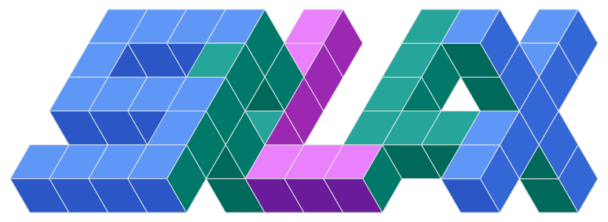

# splax

<div align="center">
  
</div>

**Differentiable 3D gaussian splatting for JAX, with rasterization kernels written in [NVIDIA Warp](https://github.com/NVIDIA/warp).**

splax renders and trains 3D gaussian splats inside JAX. Projection, rasterization, and their backward passes run as Warp kernels wired into JAX through FFI custom calls under `jax.custom_vjp`, so rendering composes with `jax.vmap`, `jax.grad`, and `jax.jit`. No system CUDA toolchain is required.

## Hero example

```python
import jax.numpy as jnp
import splax

means, scales, quats, colors, opacities = splax.io.load_ply("scene.ply")
img, _ = splax.render(
    means, scales, quats, colors, opacities, viewmat=viewmat,
    background=jnp.ones(3), img_shape=(H, W), f=(fx, fy),
)  # (H, W, 3)
```

## Render entry point

[`splax.render`](user-guide/rendering.md) handles the rendering and is differentiable with respect to the gaussian parameters, the [camera pose, and per-object rigid transforms](user-guide/training.md).

## Where to go next

- [Installation](get-started/install.md) covers the pip install, GPU requirements, and the pixi developer setup.
- [Quickstart](get-started/quickstart.md) walks through rendering a scene, batching with `jax.vmap`, and taking a gradient.
- [User Guide](user-guide/rendering.md) documents rendering, training, batching, and PLY IO.
- [API Reference](api/index.md) is generated from the source.
